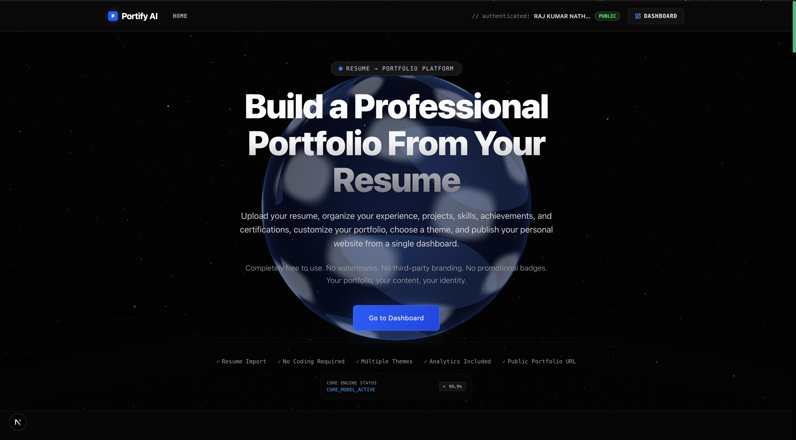
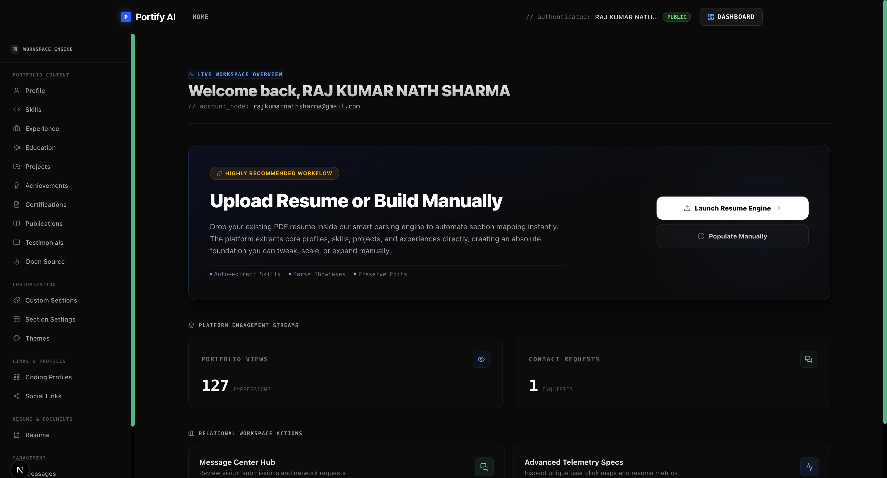
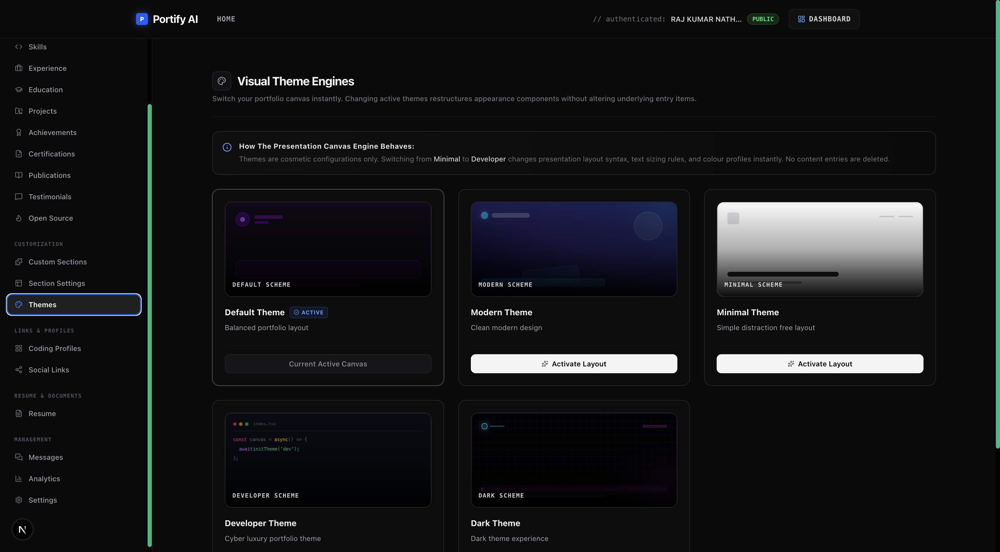
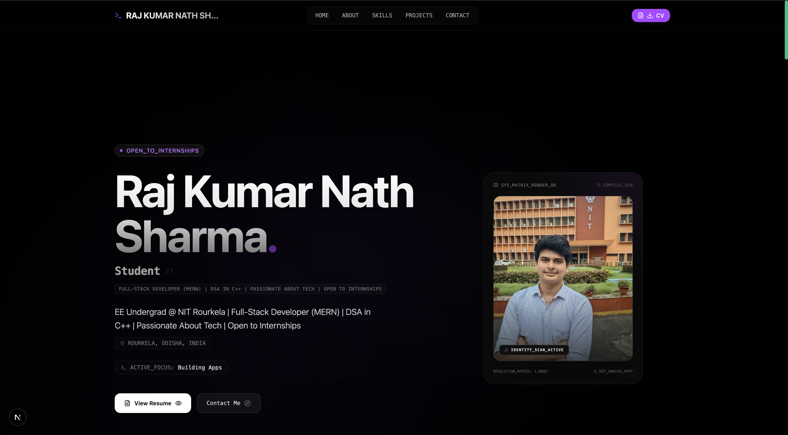

#Portify AI

A full-stack SaaS portfolio builder that enables students, developers, engineers, researchers, designers, freelancers, and professionals to create, manage, and publish modern portfolio websites without writing code.

Portify AI transforms resume data into structured portfolio content, allows complete customization, supports multiple themes, provides analytics, manages contact requests, and offers a complete portfolio management experience from a single dashboard.

⸻

#Features

Resume-Based Portfolio Creation

- Upload PDF resumes
- Automatic resume information extraction
- Structured portfolio generation
- Missing field detection
- Resume version management
- Resume download support
- Manual editing after extraction
- Resume re-import support
- Completion score tracking
- Portfolio data preservation during resume updates

Portfolio Management

- Public portfolio websites
- Custom username URLs
- Dynamic portfolio sections
- Section enable/disable controls
- Section reordering
- Custom sections
- Real-time updates
- Portfolio publishing
- Portfolio editing dashboard
- Section visibility management

Supported Portfolio Sections

- Hero
- About
- Skills
- Experience
- Education
- Projects
- Achievements
- Certifications
- Publications
- Open Source
- Coding Profiles
- Social Links
- Testimonials
- Contact
- Custom Sections

Theme System

- Default Theme
- Modern Theme
- Minimal Theme
- Dark Theme
- Developer Theme

Users can switch themes at any time without affecting portfolio data.

Authentication & Security

- Email Registration
- Google Authentication
- Email Verification
- Password Reset
- Protected Routes
- Session Management
- Role-Based Access Control (RBAC)
- Admin Approval Workflow
- Cloudflare Turnstile Protection
- Secure Password Management

Contact System

Visitors can:

- Submit contact requests
- Include name and email
- Add optional notes

Portfolio owners receive:

- Email notifications
- Dashboard notifications
- Contact request history

Analytics

- Portfolio Views
- Unique Visitors
- Resume Downloads
- Contact Requests
- Project Click Tracking

Admin Dashboard

- Approval Management
- User Management
- Platform Statistics
- Account Moderation
- User Blocking
- User Unblocking
- Portfolio Monitoring

File & Media Management

- Resume Uploads
- Profile Image Uploads
- Project Image Uploads
- Cover Image Uploads
- Cloudinary Storage Integration
- Image Optimization

Email Automation

- Verification Emails
- Approval Emails
- Rejection Emails
- Password Reset Emails
- Contact Notification Emails
- Admin Notification Emails

Testing & Quality

- Unit Testing
- End-to-End Testing
- Validation Layer
- Type Safety
- Automated Linting
- Pre-commit Checks

⸻

## Screenshots

### Landing Page



### Dashboard



### Theme Management



### Public Portfolio



⸻

## 🏗️ System Architecture

```text
┌───────────────────────────────┐
│     Frontend (Next.js 15)     │
│       React + TypeScript      │
└───────────────┬───────────────┘
                │
                ▼
┌───────────────────────────────┐
│       React Components        │
│   Forms, Dashboard, Themes    │
└───────────────┬───────────────┘
                │
                ▼
┌───────────────────────────────┐
│  Server Actions / API Routes  │
└───────────────┬───────────────┘
                │
                ▼
┌───────────────────────────────┐
│        Service Layer          │
│ Business Logic & Validation   │
└───────────────┬───────────────┘
                │
                ▼
┌───────────────────────────────┐
│          Prisma ORM           │
└───────────────┬───────────────┘
                │
                ▼
┌───────────────────────────────┐
│           MongoDB             │
└───────────────────────────────┘
```

### External Integrations

```text
Cloudinary      → File & Image Storage
OpenRouter      → Resume Data Extraction
Auth.js         → Authentication
SMTP/Nodemailer → Email Delivery
Cloudflare      → Turnstile Protection
Docker          → Containerization
Vercel/VPS      → Deployment
```

---

🛠️ Tech Stack

Frontend

- Next.js 15
- React
- TypeScript
- Tailwind CSS
- ShadCN UI
- Framer Motion

Backend

- Next.js Server Actions
- Next.js API Routes

Database

- MongoDB
- Prisma ORM

Authentication

- Auth.js (NextAuth)

Storage

- Cloudinary

Resume Processing

- OpenRouter
- PDF Parsing
- Structured Resume Extraction

Email Services

- Nodemailer
- SMTP

State Management

- Zustand

Forms & Validation

- React Hook Form
- Zod

Testing

- Jest
- Playwright

Code Quality

- ESLint
- Commitlint
- Husky
- Lint Staged
- TypeScript

DevOps & Deployment

- Docker
- Docker Compose
- Vercel

⸻

🔄 User Workflow

1. Registration

- Create account
- Verify email
- Wait for admin approval

2. Approval Process

Admin can:

- Approve users
- Reject users
- Manage platform access

3. Resume Upload

Users upload a PDF resume.

The system extracts:

- Personal Information
- Education
- Experience
- Projects
- Skills
- Certifications
- Publications
- Coding Profiles
- Social Links

4. Missing Field Detection

Portify AI identifies incomplete portfolio information and asks users to complete missing fields manually.

5. Portfolio Customization

Users can:

- Edit extracted information
- Add new entries
- Remove entries
- Manage sections
- Change themes

6. Portfolio Publishing

A public portfolio URL is generated:

/portfolio/username

⸻

🖼️ Custom Icons

Portify AI does not maintain an internal icon library.

Users can:

- Upload custom icons
- Provide icon image URLs

If no icon is provided:

- Default icons are displayed automatically

This ensures portfolios remain functional even when custom icons are unavailable.

⸻

## 📂 Environment Variables

Create a `.env` file in the project root and configure the following variables:

```env
# Authentication
AUTH_GOOGLE_ID=
AUTH_GOOGLE_SECRET=
AUTH_SECRET=
AUTH_URL=

# Database
DATABASE_URL=

# Application
NEXT_PUBLIC_APP_URL=
ADMIN_EMAIL=

# Cloudinary
CLOUDINARY_CLOUD_NAME=
CLOUDINARY_API_KEY=
CLOUDINARY_API_SECRET=

# AI & Resume Processing
OPENROUTER_API_KEY=
DEFAULT_AI_MODEL=

# Email (SMTP)
SMTP_HOST=
SMTP_PORT=
SMTP_USER=
SMTP_PASS=
SMTP_FROM=

# Cloudflare Turnstile
NEXT_PUBLIC_TURNSTILE_SITE_KEY=
TURNSTILE_SECRET_KEY=
```

### Environment Variable Descriptions

| Variable                       | Description                                 |
| ------------------------------ | ------------------------------------------- |
| AUTH_GOOGLE_ID                 | Google OAuth Client ID                      |
| AUTH_GOOGLE_SECRET             | Google OAuth Client Secret                  |
| AUTH_SECRET                    | Auth.js encryption secret                   |
| AUTH_URL                       | Base authentication URL                     |
| DATABASE_URL                   | MongoDB connection string                   |
| NEXT_PUBLIC_APP_URL            | Public application URL                      |
| ADMIN_EMAIL                    | Administrator email address                 |
| CLOUDINARY_CLOUD_NAME          | Cloudinary cloud name                       |
| CLOUDINARY_API_KEY             | Cloudinary API key                          |
| CLOUDINARY_API_SECRET          | Cloudinary API secret                       |
| OPENROUTER_API_KEY             | OpenRouter API key                          |
| DEFAULT_AI_MODEL               | Default AI model used for resume processing |
| SMTP_HOST                      | SMTP server host                            |
| SMTP_PORT                      | SMTP server port                            |
| SMTP_USER                      | SMTP username                               |
| SMTP_PASS                      | SMTP password                               |
| SMTP_FROM                      | Sender email address                        |
| NEXT_PUBLIC_TURNSTILE_SITE_KEY | Cloudflare Turnstile site key               |
| TURNSTILE_SECRET_KEY           | Cloudflare Turnstile secret key             |

---

## ⚙️ Installation

### 1. Clone Repository

```bash
git clone https://github.com/RAj26-luj/portify-ai.git
cd portify-ai
```

### 2. Install Dependencies

```bash
npm install
```

### 3. Configure Environment Variables

Create a `.env` file in the project root and configure all required environment variables.

### 4. Generate Prisma Client

```bash
npx prisma generate
```

### 5. Push Database Schema

```bash
npx prisma db push
```

### 6. (Optional) Seed Database

```bash
npx prisma db seed
```

### 7. Start Development Server

```bash
npm run dev
```

Application will be available at:

```text
http://localhost:3000
```

### 8. Build for Production

```bash
npm run build
```

### 9. Start Production Server

```bash
npm start
```

---

🧪 Testing

Unit Tests

npm test

Watch Mode

npm run test:watch

Playwright E2E Tests

npx playwright test

Build Validation

npm run build

Lint

npm run lint

⸻

🐳 Docker

Build Image

docker build -t portify-ai .

Run Container

docker run -p 3000:3000 portify-ai

Docker Compose

docker-compose up --build

⸻

## 📁 Project Structure

```text
src/
├── actions/         # Server actions
├── app/             # Next.js App Router pages & API routes
├── components/      # Reusable UI components
├── config/          # Application configuration
├── constants/       # Static constants & enums
├── hooks/           # Custom React hooks
├── jobs/            # Scheduled jobs & cleanup tasks
├── lib/             # Shared utilities & integrations
├── prompts/         # Resume parsing prompts
├── providers/       # React providers
├── services/        # Business logic layer
├── store/           # Zustand state management
├── tests/           # Unit tests
├── themes/          # Portfolio themes
├── types/           # TypeScript types
└── validators/      # Zod validation schemas
```

---

🎯 Core Goal

Portify AI helps users transform resume data into structured portfolio content, complete missing information, customize portfolio sections, switch themes, publish professional portfolio websites, receive contact requests, monitor portfolio engagement analytics, and maintain a professional online presence from a single unified dashboard.

⸻

👨‍💻 Author

Raj Kumar Nath Sharma

B.Tech, Electrical Engineering
National Institute of Technology Rourkela

- Full Stack Development
- Next.js
- TypeScript
- MongoDB
- Cloud Computing
- Competitive Programming

⸻

📜 License

This project is licensed under the MIT License.

⸻

⭐ If you found this project useful, consider giving it a star.
